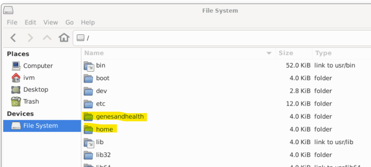
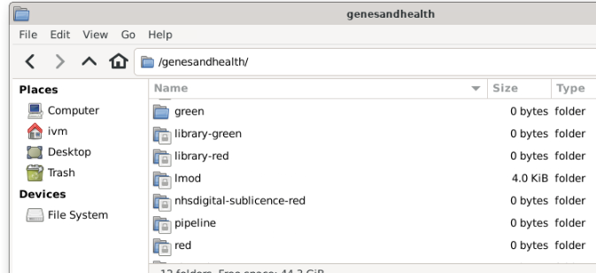

# Folder and bucket structure

To undertand how Genes & Health data are stored and how to use the data resources, we need to understand **Google Cloud Storage (GCS) buckets**.  GCS buckets are used for all data storage in the TRE with the exception of user data in the `home` directory.

!!! note "`home` directory"
    The `home` directory is associated with the Gene & Health virtual machines rather than GCS --so it is (and behaves as) a standard unix directory.  Files and directories in `home` are created, manipulated and deleted as in Unix/Linux.  Strictly speaking, your `home` directory is a sub-directory of `home`: `/home/ivm` --you have read/write access to `/home/ivm` but read only to `/home`
    !!! success "`home` directory persistence"
    The `home` directory is persistent --when you close a virtual machine, the home direcotry will not be deleted and will present the same way next time you spin a new virtual machine --regardless of the configuration of the new VM.  Although the `home` directory is persistent, its use is recommended only for development purposes; we advise ensuring critical code and data are regularly copied to the `red` folder.

## Understanding Google Cloud Storage (GCS) buckets

Genes & Health TRE data are stored in Google Cloud Storage (GCS) buckets (on a server located in London, UK). Buckets are the basic data container for GCS and everything stored in GCS must be contained in a bucket.

Each of the G&H TRE top level storage domains are separate GCS buckets, for example, `library-red`, `red`, `green` and `exomes-library-red`. Files in a G&H TRE bucket are just that. The bucket contains a collection of files.

### GCS buckets and directories

The concept of a physical directory does not rightly exist in GCS. Rather, directories are “simulated” by GCS from the files name. This can be illustrated as follows:  


In the image above, the filenames are `A/Obj1.txt`, `A/Obj2.txt`, `B/Obj3.txt`, `B/D/Obj3.txt` and `B/D/Obj4.txt` and the files simply exists a files in the bucket with those filenames. Bucket folders `A/`, `B/` its sub-folder `D/` are simulated. This means that if you were to delete `A/Obj1.txt` and `A/Obj2.txt`, the simulated folder `A/` would disappear (there would no longer be any files justifying its existence). However, if you were to delete file `B/Obj3.txt`, both simulated folder `B/` its sub-folder `D/` would remains as they would be accounted for by filenames `B/D/Obj3.txt` and `B/D/Obj4.txt`.

If you were to delete all the .txt files in the bucket, all of the directories would disappear but the bucket would remain in existance.

## G&H's `root` directory (`/`)

The G&H data buckets reside in the `genesandhealth` folder of the VM's root directory (`/`).  The `home` directory also resides within the VM's root directory.  

!!! warning
    Other directories under the VM's root directory are system, software and VM related folders and not of use to TRE users.



## G&H data buckets

G&H data buckets can be found in the `/genesandhealth` directory.  Depending on your sandbox, you will see different buckets (essentially behaving as directories) in your `/genesandhealth` directory

!!! info "Bucket nomenclature"
    G&H buckets are named `red` and `green` or suffixed with `-red` or `-green` to indicate the type of data stored in them: `red` is for potentially sensitive data that **should not be shared outside your sandbox**; `green` is for data that can be shared with the outside world. 
    
When you log into your sandbox, your VM will have a number of buckets available for you.  Here are some of the buckets (top level "directories") in the G&H sandbox-1 TRE:



### Identifying G&H GCS buckets

G&H buckets can be identified into two way within the TRE --depending on the file operation you may need to use one or the other method of identifying the bucket:
1. As a path on the virtual machine (e.g. (`/genesandhealth/red/`)
2. As a Google Cloud Storage bucket identified by a Uniform Resource Locator (URL), for example `gs://qmul-production-sandbox-1-red/` identifies the `red` bucket on sanddox-1.

The bucket's URL will depend on the sandbox you use.  

## What's in the bucket?

The _fundamental_ storage resources in the TRE are:
* the `library-red` and `red` buckets containing respectively the G&H -omics data and your sandbox's data
* your `home` directory

These exist alongside a number of other data resources as illustrated below.  Key data resources are then individually described.

{ width = 80% }

### Your `home` directory

Available at `/home/ivm` in your sandbox, this is your personal folder. This folder can be used to store any files you wish to keep for short duration in your working directories. `/home/ivm` is a semi-fast (HDD) storage and as such is faster than other parts of the sandbox. It might be worth running some jobs here, especially if you are loading large amounts of data.

This folder should not be treated as a permanent/long-term storage so anything you want to keep should be moved to the `red` folder. However, snapshots of the disk/folder are taken on daily basis and are retained for a period of 7-days. In-case you accidently delete some useful data from the `/home/ivm` folder, you can reach out to the TRE Admins to check if it is possible to recover the disk to a previous snapshot date within last 7 days.

This works as a standard Unix/Linux directory and is **not** a google GCS bucket. 

### `(-)red` buckets 

#### The `library-red` bucket \[read-only for users\]

!!! info "Identifying `library-red`
    * Specificity: common to all sandboxes
    * VM directory: `/genesandhealth/library-red/`
    * URL: `gs://qmul-sandbox-production-library-red/`

This is a **read-only** folder that is common to all TRE users. `library-red` stores curated and raw data necessary for your analyses; it includes several subfolders, each designated for specific data types and purposes.  For technical reasons, the data subfolders are actually in `/genesandhealth/library-red/genesandhealth/`.  Folder names are (relatively) self-explanatory and all of them should contain a `README` type file explaining their content.  If you find a folder without a `README` file, please contact the Genes and Health team for more information on its intended use.

#### The `red` bucket

!!! info "Identifying `red`
    * specificity: sandbox specific
    * VM directory: `/genesandhealth/red/`
    * URL: `gs://qmul-production-sandbox-XX-red/` (replace `XX` with your sandbox number) 

The `red` bucket is a read-write bucket for TRE users to store scripts and data safely (with versioning back-up) and to permit the sharing of these between project collaborators. It is the only GCS bucket **directly** accessible to non-admin TRE users.  You are advised to create your own subfolder in `red`; user folders are typically created as FirstnameLastname (so `/genesandhealth/red/StuartRison/`) although some iconoclasts have broken this convention.

!!! info "Using the red bucket"
    The `red` directory is a GCS bucket so you cannot simply copy or create files into it using standard unix/linux commands.  You either need to use the "Upload to red bucket" option in the TRE's GUI file manager or the `gcloud storage` suite of command line interface commands.  This is explained in the TBC (how-to-use-the-red-bucket) section.

!!! danger "With great power..."
    comes great responsability".  The `red` bucket is shared between all sandbox users **--even if you have created your own sub-directory**.  This means that you can:
    * See all other sandbox users' files (and all other sandbox users can see your files)
    * Move/rename/delete **any** sandbox users' files 
    <p>
    Exercise great caution when moving or deleting files in the `red` bucket.

#### The `consortiumpriorityperiod-library-red` bucket

!!! info "Identifying `consortiumpriorityperiod-library-red`
    * specificity: restricted sandboxes
    * VM directory: `/genesandhealth/consortiumpriorityperiod-library-red/`
    * URL: `gs://qmul-sandbox-production-library-consortiumpriorityperiod-red` 

This bucket is only available to the core Genes & Health team, and to companies in the Genes & Health Industry Consortium. It contains data restricted during 9 month priority access periods (e.g. exome sequencing). Specifically, read access is only for sandboxes 1, 3, 4, 5, 6, 7, 9, 10, 13.

Same storage type as /genesandhealth/library-red, see comments above

### `(-)green` buckets

#### The `green` bucket \[read-only for users\]

!!! info "Identifying `green`
    * Specificity: sandbox specific
    * VM directory: `/genesandhealth/green/`
    * URL: `gs://fg-qmul-production-sandbox-XX\_green/` (replace `XX` with your sandbox number) 

`green` can be read by other users in the sandbox. Users cannot write to `green`.  Users can download from `/genesandhealth/green` from internet/external systems.

The admin team will review data-out requests, and either place the data in `green` (for specific users to download, short term) or `library-green` (long term availability for all users to download).

!!! warning "Data in `green`
    Data in each sandbox's `green` will be deleted approximately 1 week after creation. `green` is not intended for long term storage, only data transfer/download.

#### The `consortiumpriorityperiod-library-green` bucket

!!! info "Identifying `consortiumpriorityperiod-library-green`
    * Specificity: restricted sandboxes
    * VM directory: `/genesandhealth/consortiumpriorityperiod-library-green/`
    * URL: `gs://qmul-sandbox-production-library-consortiumpriorityperiod-green`
    
Access as for `consortiumpriorityperiod-library-red` but with external download enabled. Used for results. **Not for individual level data**.

### Other folders

#### `shared`

You can 'publish' a file to `/genesandhealth/shared` by right clicking on it, and selected 'Share with all users'

`/genesandhealth/shared` is available to all other users within the TRE.

#### `pipelines`

This is the output of the high performance compute WDL Pipelines, that the ivm/pipeline writes to. Users of the sandbox have read only access.

Specific to each sandbox.

This is slower storage of large capacity (\>8 PiB @ Feb 2022\)

#### Public datasets bucket

We also maintain a bucket for public datasets. This is not visible from within the TRE. Much of the data is mirrored in `/genesandhealth/library-green/` within the TRE.

```
gs://genesandhealth\_publicdatasets/
```

## Moving TRE data

TRE user have two data storage resources available to them: i) their virtual machine `home` directory (`/home/ivm`), ii) the `red` GCS bucket.  Users therefore need to be able to perform one of three file handling operations:

1. Copying data from `library-red` or `red` to `/home/ivm`
2. Copying data from `/home/ivm` to `red`
3. Deleting data from `red`

!!! note
    Users may also wish to move/copy/rename/delete files and directories within `/home/ivm/` however, as prevously stated `home` behaves as a standard unix/linux filesystem and therefore standard unix `mv`, `cp`, `rm`, `rmdir` commands can be used for file manipulation.  

The three ways to manipulate folders and files in the red bucket are:

1. using the “Upload to red bucket” option in the File Manager,  
2. using the gcloud command line interface,  
3. mounting your red folder into your virtual machine.

### Copying data to red

Once you have located the file/folder you want to copy into red, right click on that object and select “Upload to red bucket”:


A new window will then pop-up allowing you to select where in red you want this data to go (“red” is the top directory in red so it’s recommended you navigate to a personal or project red directory before selecting “OK”):  


* You can use the “Browse” button to find and select existing directories in red.

* If you select the “Create New Folder” button, it will prompt you for a name, and then create a new folder in the location currently selected.

* Selecting “OK” will begin the copying process into the directory chosen and you will see a new window documenting the outcome, for example:   
    


## Folder structures

### consortiumpriorityperiod-library-red

This bucket is only available to the core Genes & Health team, and to companies in the Genes & Health Industry Consortium. It contains data restricted during 9 month priority access periods (e.g. exome sequencing). Specifically, read access is only for sandboxes 1 3 4 5 6 7 9 10 13\.

Same storage type as **/genesandhealth/library-red**, see comments above

**/genesandhealth/consortiumpriorityperiod-library-red** is a google storage bucket **gs://qmul-sandbox-production-library-consortiumpriorityperiod-red** (read+write only for admins)

### Green folders

#### **green**


### Copying between Google Buckets within the TRE

Is permitted from within the TRE, subject to user read/write permissions as above.

Admins may copy from Google Buckets to external systems. However external copy from external Google Buckets direct to/from TRE Google Buckets is prohibited for security reasons.

### Backups

Data in selected folders is protected from accidental deletion or alteration by the Google Object Versioning service. Specifically, for data in these folders \-

#### **Shared folders**

/genesandhealth/library-red , 1 version, 30 days

/genesandhealth/consortiumpriorityperiod-library-red, 1 version, 30 days

/genesandhealth/nhsdigital-sublicence-red, 1 version, 30 days

#### **Sandbox-specific folders**

/genesandhealth/red, 2 versions, 30 days

/genesandhealth/pipeline, 1 version, 7 days

We will keep either a) the prior version of the data prior to a change (or deletion) by a user for 30 days , or b) two prior versions of the data prior to a change (or deletion) by a user for 30 days.

This allows the prior version to be restored, in the event of accidental erasure or deletion.

To say this another way: imagine you accidentally alter or delete a file in the /genesandhealth/library-red folder. Then the version of the file prior to its removal can be restored, for up to 30 days after the change. In the sandbox-specific /genesandhealth/red folder, two prior versions of the file will be kept, each for 30 days after the change leading to its creation.

Restoring a prior version of an accidentally removed or modified file requires utilities only available to administrators: if you need this, contact us using Slack or writing to hgi@sanger.ac.uk, including the word "Urgent" in the subject header.
