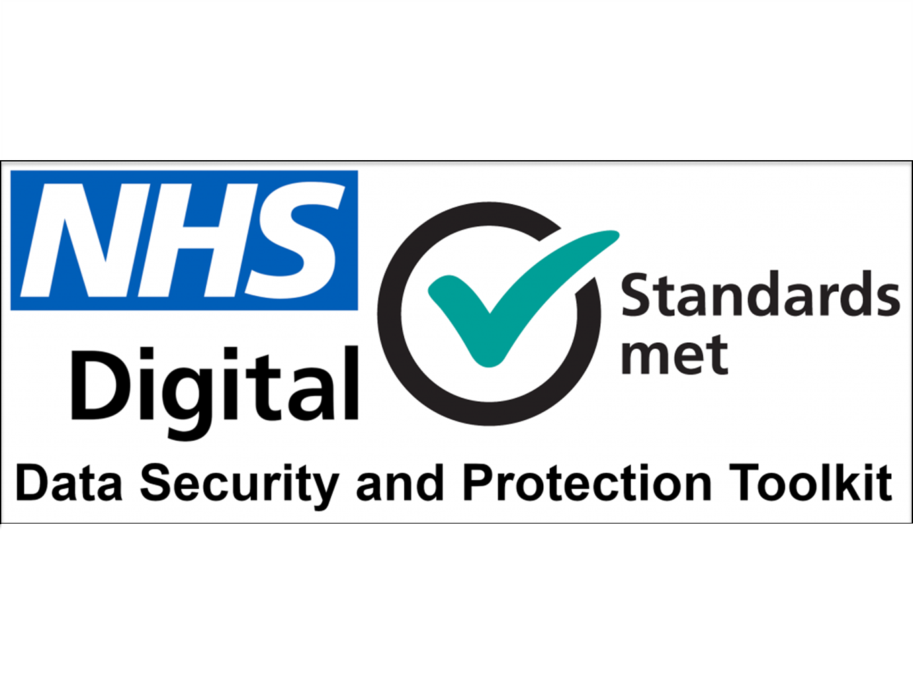

# What is a TRE ?

A TRE is a Trusted Research Environment.  Many large genetics and health data studies such as Finngen, UK Biobank, Genomics England are using TREs. NHS England and Health Data Research UK are strongly supporting this model. 

## Is a TRE the same as a Secure Data Environment?

Probably! Many think of Trusted Research Environments and Secure Data Environments (SDEs) as synonymous, some don't (although the differences are subtle).  NHS England's secure data and research analysis platform was rebranded from "NHS Digital’s Trusted Research Environment (TRE) service for England" to the NHS Secure Data Environment (SDE) (itself a part of an interoperable NHS Research Secure Data Environment network). 

At present, the Genes & Health  secure data and research analysis platform remains identified as a TRE 

!!note
    It's probably not worth worrying about such things anyway.

## What defines a TRE?

The essential qualities of a TRE are:

- The TRE restricts access to data inside the TRE to authenticated users, who are given access in a highly controlled manner  
- The TRE doesn’t allow users to export data without inspection from the project’s Data Controller or a delegate.  
- The TRE doesn’t allow users to import code or data without inspection from the project’s Data Controller or a delegate.

Researchers must enter the secure environment of a TRE to work on the data inside, and cannot export summary results without inspection, to ensure no sensitive personal data is being exported --the scientist come to the data, the data do not go to the researchers.

## How secure is the Genes & Health TRE?

In our case, many NHS Providers will not supply clinical data (including sensitive personal data) for G&H participants unless G&H can house the data in an ISO27001-certified TRE.  ISO 27001 is an internationally recognized standard that specifies the requirements for establishing, implementing, maintaining, and continually improving an Information Security Management System (ISMS).

The Genes & Health TRE is ISO/IEC 27001:2022 certified and NHS Data Security and Protection Toolkit registered (version 7; 30/06/2025)

{ width="100%" }

{ width="250" } { width="200" } 

